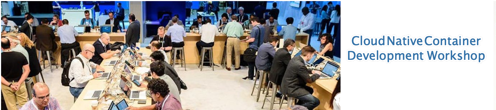

**Session Objective:**  Introduction to cloud native development using containers and Kubernetes. We will begin with an overview of the "what" and "why" of Docker containers and an overview of container orchestration with Kubernetes. We will then discuss the develpment process to build containerized applications and deploy them to the cloud. In addition to lecture and discussion will be some hands on labs to demonstrate how to install the required tools and see how containers work in practice with IBM Cloud Private. Attending this session will give you the basic skills to explore and experiment with containers to determine how they best fit your use cases, or just to have fun with them!

---

### Agenda Overview

**Presentation and Discussion**

In this segment we'll talk through the basics:
- What are "containers" and where did they come from?
- What's the difference between containers and Virtual machines?
- What's "container orchestration" and what's [Kubernetes](https://kubernetes.io/) all about?
- Overview of a few development tools that help make it easier to develop cloud native applications.  

**Exercises**

- [lab 00](lab00/README.md): Creating a working environment
- [lab 01](lab01/README.md): Building your own docker container

**Getting Started with kubernetes**

- [lab 02](lab02/README.md): Running Kubernetes with IBM Cloud Private
- [lab 03](lab03/README.md): Deploying a container to Kubernetes

**Deploying an application on kubernetes**

- [lab 04](lab04/README.md): Containerize and deploy a node.js application

**Questions?**

---
