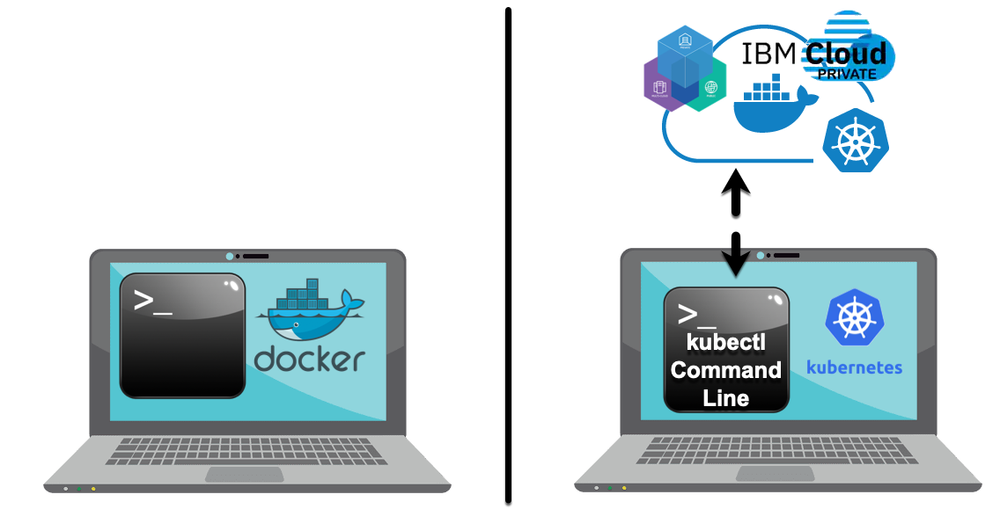

### Creating a Working Environment
In this section we'll install the Docker engine so we can run containers locally. We'll also install the kubectl client to connect to the IBM Cloud Private (ICP) cluster and run the exercises.


**Installing the Docker engine**

First, we'll get the docker engine installed on our local machine. That will enable us to run some containers locally and begin to understand them better.

If you're [hearing about Docker for the first time](https://www.docker.com/what-container), the Docker website is a great place to get context.

The getting started guide on Docker has detailed instructions for installing Docker for [Mac](https://store.docker.com/editions/community/docker-ce-desktop-mac), [Windows](https://store.docker.com/editions/community/docker-ce-desktop-windows)

When Docker is installed, it can be easily tested by running the "hello-world" container:
```
$ sudo docker run hello-world
Unable to find image 'hello-world:latest' locally
latest: Pulling from library/hello-world
ca4f61b1923c: Pull complete
Digest: sha256:66ef312bbac49c39a89aa9bcc3cb4f3c9e7de3788c944158df3ee0176d32b751
Status: Downloaded newer image for hello-world:latest

Hello from Docker!
This message shows that your installation appears to be working correctly.
```

---

**Using IBM Cloud Private**

The environment we'll use for this session is an IBM Cloud Private cluster.

[IBM Cloud Private](https://www.youtube.com/watch?v=yzXA3qhfaq0) is an application platform for developing and managing on-premises, containerized applications. It is an integrated environment for managing containers that includes the container orchestrator Kubernetes, a private image repository, a management console, and monitoring frameworks.

Make sure you remember the number next to your name on the sign-up sheet... that'll help you figure out your username so you can login to the cluster.


We'll also need to [install the kubectl client](https://kubernetes.io/docs/tasks/tools/install-kubectl/#install-kubectl-binary-via-curl)... for this tutorial we'll install the current version of kubectl ... download either the [Mac](https://dl.k8s.io/v1.10.0/kubernetes-client-darwin-amd64.tar.gz), [Linux](https://dl.k8s.io/v1.10.0/kubernetes-client-linux-amd64.tar.gz) or [Windows](https://dl.k8s.io/v1.10.0/kubernetes-client-windows-amd64.tar.gz) binaries appropriate for your system and make sure its available in your path.

If you're using mac or linux, you'll need to make sure the binary is executeable using
```
$chmod +x kubectl

$cp ./kubectl /usr/local/bin/kubectl
```

Now that its executeable, you can copy it in your path by moving it to /usr/local/bin

Next, lets check that kubectl is installed... You should be able to see the help menu for the kubectl command.

```
$kubectl help

```

If successful you should see something like this in the terminal window.

```
kubectl controls the Kubernetes cluster manager.

Find more information at: https://kubernetes.io/docs/reference/kubectl/overview/

Basic Commands (Beginner):
  create         Create a resource from a file or from stdin.
  expose         Take a replication controller, service, deployment or pod and expose it as a new Kubernetes Service
  run            Run a particular image on the cluster
  set            Set specific features on objects
  ```


---
