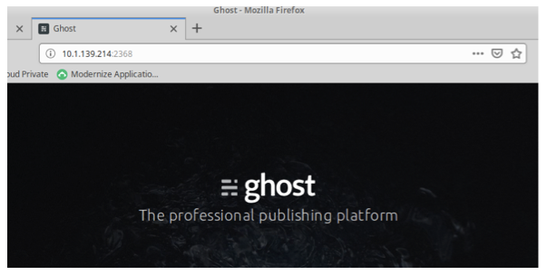

# Deploying a Container to Kubernetes

**In this section**, we'll run our first container on Kubernetes. We'll work with a docker image that already has content in it. One of the things that makes containers easy and helpful is you can obtain images with software that's been pre-packaged and ready to run... that simplifies the usual effort to install and configure software.

## Kubernetes Command Line Tool:   kubectl
The kubectl is a command line tool to communicate with the Kubernetes master node that runs an API server. The API server provides REST API endpoints and kubectl internally uses the REST APIs to communicate with the API server, which communicates with Docker. We need to configure the kubectl command line tool, so that it can communicate with the IBM Cloud Private Kubernetes platform.


***	
**Note:** It is a best practice to use the kubectl version that matches with the Kubernetes. We used the following command to extract kubectl from the IBM Cloud Private containers. 

*** 

__1. 	Kubectl must be configured for the environment that it will be executing against. The commands to do this are available from IBM Cloud Private admin console.

__2. 	Launch your Web Browser. 

__3. 	Enter the URL for the IBM Cloud Private console.

__4.  Login with the credentials you were given by the instructor.

__5. 	After you into the IBM Cloud Private console , click on the white circle with the black head and shoulders in the far right and select Configure client.

__6. 	You will see a list of kubectl commands. You can manually copy these or click on the blue boxes to the right of the window to copy the commands to the clipboard.

__7. 	Open a terminal window. 

__8. 	Paste the block of commands into the terminal window and verify that they execute correctly. 

**The kubectl command line interface is now configured to communicate with the IBM Cloud Private runtime.**


## Running a few kubectl commands

__1. 	Check the Client and Kubernetes version with this command. 

```	
$ kubectl get version
```

__2. 	Determine if the cluster is healthy with this command.

```	
$ kubectl get componentstatuses
```

__3. 	List all the nodes in our cluster with this command. 

```	
$ kubectl get nodes
```
**Output will look similar to this:**

```
NAME             STATUS   ROLES               AGE   VERSION
169.62.170.88    Ready    worker              35d   v1.12.4+icp-ee
169.62.170.91    Ready    management          35d   v1.12.4+icp-ee
169.62.193.244   Ready    worker              35d   v1.12.4+icp-ee
169.62.193.246   Ready    etcd,master,proxy   35d   v1.12.4+icp-ee
```

__4. 	You can also use kubectl describe node command to get more information about a specific node. This command displays basic information about a node. 

```	
$ kubectl describe node
```

**Output of the command will look similar to this.**

```
Name:           192.168.142.140
Roles:           etcd,management,master,proxy,worker
Labels:         beta.kubernetes.io/arch=amd64

```

**Note that this node is running the Linux OS and is a master node. Next, see the information about the operation of node itself.**


```
Conditions: Type             Status  LastHeartbeatTime                 LastTransitionTime                Reason                       Message
  ----             ------  -----------------                 ------------------                ------                       -------
OutOfDisk        False   Mon, 03 Dec 2018 20:31:15 -0700   Fri, 09 Nov 2018 08:48:05 -0700   KubeletHasSufficientDisk     kubelet has sufficient disk space available
MemoryPressure   False   Mon, 03 Dec 2018 20:31:15 -0700   Fri, 09 Nov 2018 08:48:05 -0700   KubeletHasSufficientMemory   kubelet has sufficient memory available
DiskPressure     False   Mon, 03 Dec 2018 20:31:15 -0700   Fri, 09 Nov 2018 08:48:05 -0700   KubeletHasNoDiskPressure     kubelet has no disk pressure
PIDPressure      False   Mon, 03 Dec 2018 20:31:15 -0700   Fri, 09 Nov 2018 08:48:05 -0700   KubeletHasSufficientPID      kubelet has sufficient PID available
Ready            True    Mon, 03 Dec 2018 20:31:15 -0700   Fri, 09 Nov 2018 09:06:47 -0700   KubeletReady                 kubelet is posting ready status. AppArmor enabled

```

__5. 	The status of the node indicates that it has sufficient disk and memory. And, it is in Ready state. The information about capacity displays next. 

```
Addresses:
  InternalIP:  192.168.142.140
  Hostname:    192.168.142.140
Capacity:
 cpu:                8
 ephemeral-storage:  101651448Ki
hugepages-1Gi:      0
hugepages-2Mi:      0
 memory:             20543064Ki
 pods:               80
Allocatable:
 cpu:                8
 ephemeral-storage:  93681974322
 hugepages-1Gi:      0
 hugepages-2Mi:      0
 memory:             20440664Ki
 pods:               80
```

__6. 	Next the kernel and OS information for the node. 

```
System Info:
 Machine ID:                 e536cc852ed34e60abd0ab2c9166d019
 System UUID:                564DF4C2-9DA0-0DE8-FB36-234D64E2D51E
 Boot ID:                    a00e1b96-2198-4f23-b2b3-a9e3c7481e47
 Kernel Version:             4.15.0-39-generic
 OS Image:                   Ubuntu 18.04.1 LTS
 Operating System:           linux
 Architecture:               amd64
 Container Runtime Version:  docker://18.6.1
 Kubelet Version:            v1.11.1+icp-ee
 Kube-Proxy Version:         v1.11.1+icp-ee
```

__7. 	Run command kubectl get pods. Note: The name space set when logging into kubectl is employed when the -n switch is not defined, cert-manager namespace is this case.

```
$ kubectl get pods
```

**Output will look similar to this:**

```
NAME                                             READY     STATUS    RESTARTS   AGE
ibm-cert-manager-cert-manager-568fdd9448-wrr5v   1/1       Running   8          25d
ibmdemo@ubuntuvm1:~$

```

__8. 	Get the list of running pods in kube-system namespace. 

```
$ kubectl get pods -n kube-system
```

**Output will look similar to this:**

```
NAME                                                           READY     STATUS      RESTARTS   AGE
audit-logging-fluentd-ds-dt2fq                           1/1       Running     	7          24d
auth-apikeys-zhw95                                          1/1       Running     	7          24d
auth-idp-krv66                                                  4/4       Running     		34         24d
auth-pap-r2gsz                                                 1/1       Running     		8          24d
auth-pdp-gd26s                                                 2/2       Running     	14         24d
calico-kube-controllers-d775694f-hchq6           1/1       Running     	8          24d
calico-node-wbm7j                                              2/2       Running     	16         24d
catalog-ui-fnd2d                                                1/1       Running     	8          24d
custom-metrics-adapter-68ccc557b-96zpj         1/1       Running    	 7          24d
default-backend-77584cb658-2hlbk                    /1       Running     8          24d
heapster-bf56655b-87wtr                                        1/1       Running     34         24d
helm-api-ff47bb697-fpkpk                                       3/3       Running     25         24d
helm-repo-67bd4d995-hmdmk                                      2/2       Running     21         24d
ibmcloud-image-enforcement-6874cf8f75-vlr4c                    1/1       Running     7          24d
icp-management-ingress-md46n                                   1/1       Running     8          24d
icp-mongodb-0                                                  1/1       Running     7          24d
image-manager-0                                                2/2       Running     16         24d
k8s-etcd-192.168.142.140                                       1/1       Running     10         24d
k8s-master-192.168.142.140                                     3/3       Running     49         24d
k8s-proxy-192.168.142.140                                      1/1       Running     10         24d
kube-dns-74xxw                                                 1/1       Running     8          24d
logging-elk-client-6bbc7f8967-snrdj                            3/3       Running     43         24d
logging-elk-data-0                                             1/1       Running     8          24d
logging-elk-elasticsearch-tls-init-g5ccz                       0/1       Completed   0          24d
logging-elk-filebeat-ds-hxwd9                                  1/1       Running     8          24d
logging-elk-kibana-84f66989fd-2m7j6                            2/2       Running     38         24d
logging-elk-logstash-694854bc66-8gc67                          1/1       Running     9          24d
logging-elk-master-6c8488ddc4-6gkpt                            1/1       Running     9          24d
mariadb-0                                                      1/1       Running     8          24d
metering-dm-7f87d54867-xqfkc                                   1/1       Running     8          24d
metering-reader-pff5n                                          1/1       Running     7          24d
metering-ui-786675669c-9d9wk                                   1/1       Running     6          24d
metrics-server-5d76677cdb-nl5dx                                1/1       Running     40         24d
mgmt-repo-7cc78c6d74-lgl8w                                     2/2       Running     21         24d
monitoring-grafana-7c587579dc-jp9fq                            2/2       Running     14         24d
monitoring-prometheus-alertmanager-576694f796-b4c8r            3/3       Running     21         24d
monitoring-prometheus-collectdexporter-7c594978b7-jk22l        2/2       Running     16         24d
monitoring-prometheus-d5ccc46d7-cpkbm                          4/4       Running     50         24d
monitoring-prometheus-elasticsearchexporter-7cdbf99764-28j7w   2/2       Running     16         24d
monitoring-prometheus-kubestatemetrics-6c7759c856-z2mtj        2/2       Running     14         24d
monitoring-prometheus-nodeexporter-xl2pn                       2/2       Running     16         24d
nginx-ingress-controller-pzxj9                                 1/1       Running     8          24d
nvidia-device-plugin-swfrs                                     1/1       Running     8          24d
oidc-client-registration-fk5zt                                 0/1       Completed   0          24d
platform-api-489g6                                             2/2       Running     16         24d
platform-deploy-zsfhx                                          1/1       Running     8          24d
platform-ui-n77wf                                              1/1       Running     8          24d
secret-watcher-65c59c79bf-47vxq                                1/1       Running     8          24d
security-onboarding-lpncc                                      0/1       Completed   0          24d
service-catalog-apiserver-hsxlq                                1/1       Running     8          24d
service-catalog-controller-manager-5cf64d4bb-n5sdm             1/1       Running     21         24d
tiller-deploy-57b467b45b-n4755                                 1/1       Running     9          24d
unified-router-nmfhv                                           1/1       Running     7          24d
```
__9. 	Note the function of each pod.

| Pod           | Function           |
| ------------- |:------------------:|
|auth (various) | Authentication (Keystone is used)|
|calico (various) |	Networking and network policy |
|catalog and default-http-backend	 | ICP catalog and web UI |
|elasticsearch, logstash | ELK stack (We did not install Kibana.) |
|filebeat	| Log data shipper for log files |
|heapster	| Cluster-wide aggregator of monitoring and event data |
|GlusterFS | Distributed file system |
|heketi |	It provided REST API endpoint for GlusterFS |
|helm-api, helmrepo	| Package manager and repo for software bundles (client)| 
|icp-ds	| Cloudant database |
|icp-management-ingress	 | Manages external access to management node |
|image-manager |	ICP local image manager |
|k8s-etcd	| Kubernetes etcd database to hold state of cluster |
|k8s-mariadb |	MariaDB (mySQL) database used by keystone |
|k8s-master	| Master pod |
|k8s-proxy	| Proxy pod |
|kube-dns |	DNS service |
|nginx-ingress |	Forward outside traffic to in-cluster services |
|platform-api	 | |
|platform-deploy	| |
|platform-ui	| |
|rescheduler	| Proactively relocates running pods to optimize the layout |
|tiller-deploy	| Server component of Helm charts deployment |
|unified-router	| Backend functioning of management console |

__10. 	Run command kubectl get the nodes  

```
kubectl get nodes
```

***output should look similar to the following***

```
NAME              STATUS    ROLES                                 AGE       VERSION
192.168.142.140   Ready     etcd,management,master,proxy,worker   25d       v1.11.1+icp-ee
```

__11. 	Run the following command kubectl -n kube-system get pods | grep k8s-master to find the Kubernetes master node. 

```
$ kubectl -n kube-system get pods | grep k8s-master
```

***Output will look similar to the following***

```
k8s-master-192.168.142.140                                     3/3       Running     49         25d

```
The Kubernetes master node pod name is k8s-master-192.168.142.140 and, as the name suggests, it is running on 192.168.142.140. Note 3/3 in the Ready column. This signifies that there are three containers in this pod and all three are running. **Take note of your IP address, you will need it in later steps**  

**Note: Replace ###.###.###.### with your ip address**

__12. 	Let's check the containers the master pod k8s-master-*###.###.###.###*. 

***Note your pod name will likely be different. Use the name of the pid from the previous command***

```
$ kubectl -n kube-system get pod k8s-master-###.###.###.### 
```
***Output will look similar to the following.***
 
```
NAME                         READY     STATUS    RESTARTS   AGE
k8s-master-192.168.142.140   3/3       Running   49         25d
```
__13. 	The kubectl is a client that sends REST API to the API server and parses the JSON return output. Add -o json switch in the above command to see the JSON output from the API server

```
$ kubectl -n kube-system get pod k8s-master-is-###.###.###.### -o json
```
***Output will look similar to the following.***

```
{
    "apiVersion": "v1",
    "kind": "Pod",
    "metadata": {
        "annotations": {
            "kubernetes.io/config.hash": "4125c84329b04159fbd2535bec619761",
            "kubernetes.io/config.mirror": "4125c84329b04159fbd2535bec619761",
            "kubernetes.io/config.seen": "2018-11-09T08:47:41.456484034-07:00",
            "kubernetes.io/config.source": "file",
            "kubernetes.io/psp": "privileged",
            "scheduler.alpha.kubernetes.io/critical-pod": ""
        },
        "creationTimestamp": "2018-11-09T15:48:49Z",
        "name": "k8s-master-192.168.142.140",
        "namespace": "kube-system",
        "resourceVersion": "544623",
        "selfLink": "/api/v1/namespaces/kube-system/pods/k8s-master-192.168.142.140",
        "uid": "f3679ad0-e436-11e8-abb6-000c29e2d51e"
    },
    "spec": {
        "containers": [
            {
                "command": [
                    "/hyperkube",
                    "controller-manager",
                    "--master=https://127.0.0.1:8001",
                    "--service-account-private-key-file=/etc/cfc/conf/server.key",
                    "--feature-gates=TaintBasedEvictions=true,TaintNodesByCondition=true",
                    "--root-ca-file=/etc/cfc/conf/ca.crt",
                    "--min-resync-period=3m",
                    "--cluster-cidr=10.1.0.0/16",
                    "--cluster-signing-cert-file=/etc/cfc/conf/ca.crt",
                    "--cluster-signing-key-file=/etc/cfc/conf/ca.key",
                    "--use-service-account-credentials=true",
                    "--kubeconfig=/etc/cfc/conf/kube-controller-manager-config.yaml",
                    "--pv-recycler-pod-template-filepath-hostpath=/etc/cfc/conf/recycler.yaml",
                    "--pv-recycler-pod-template-filepath-nfs=/etc/cfc/conf/recycler.yaml",
                    "--experimental-cluster-signing-duration=8760h0m0s",
                    "--controllers=*,tokencleaner",
                    "--v=2",
                    "--leader-elect=true",
                    "--profiling=false",
                    "--terminated-pod-gc-threshold=5000",
                    "--horizontal-pod-autoscaler-use-rest-clients=true"
                ],
                "image": "mycluster.icp:8500/ibmcom/hyperkube:v1.11.1-ee",
                "imagePullPolicy": "IfNotPresent",
                "name": "controller-manager",
                "resources": {},
                "terminationMessagePath": "/dev/termination-log",
                "terminationMessagePolicy": "File",
                "volumeMounts": [
                    {
                        "mountPath": "/etc/cfc/conf",
                        "name": "data"
                    },
                    {
                        "mountPath": "/var/lib/icp/audit",
                        "name": "audit"
                    },
                    {
                        "mountPath": "/usr/libexec/kubernetes/kubelet-plugins/volume/exec",
                        "name": "flexvolume-dir"
                    }
                ]
            },
            {
                "command": [
                    "/hyperkube",
                    "apiserver",
                    "--secure-port=8001",
                    "--bind-address=0.0.0.0",
                    "--advertise-address=192.168.142.140",
                    "--endpoint-reconciler-type=lease",
                    "--insecure-port=0",
                    "--etcd-servers=https://192.168.142.140:4001",
                    "--etcd-cafile=/etc/cfc/conf/etcd/ca.pem",
                    "--etcd-certfile=/etc/cfc/conf/etcd/client.pem",
                    "--etcd-keyfile=/etc/cfc/conf/etcd/client-key.pem",
                    "--runtime-config=batch/v2alpha1,extensions/v1beta1=true,extensions/v1beta1/podsecuritypolicy=true,admissionregistration.k8s.io/v1alpha1",
                    "--enable-admission-plugins=Initializers,NamespaceLifecycle,LimitRanger,ServiceAccount,DefaultStorageClass,PodSecurityPolicy,MutatingAdmissionWebhook,ValidatingAdmissionWebhook,ResourceQuota,Priority,EventRateLimit,PodNodeSelector,PodTolerationRestriction",
                    "--admission-control-config-file=/etc/cfc/conf/admission-control-config.yaml",
                    "--repair-malformed-updates=false",
                    "--oidc-issuer-url=https://mycluster.icp:9443/oidc/endpoint/OP",
                    "--oidc-client-id=d869948b3f22049c23319aa2752fcf5c",
                    "--oidc-ca-file=/etc/cfc/conf/ca.crt",
                    "--oidc-groups-claim=teamRoleMappings",
                    "--tls-cert-file=/etc/cfc/conf/server.cert",
                    "--tls-private-key-file=/etc/cfc/conf/server.key",
                    "--kubelet-client-certificate=/etc/cfc/conf/kubelet-client.crt",
                    "--kubelet-client-key=/etc/cfc/conf/kubelet-client.key",
                    "--client-ca-file=/etc/cfc/conf/ca.crt",
                    "--service-account-key-file=/etc/cfc/conf/server.key",
                    "--authorization-mode=RBAC",
                    "--min-request-timeout=300",
                    "--allow-privileged",
                    "--requestheader-client-ca-file=/etc/cfc/conf/front/front-proxy-ca.pem",
                    "--requestheader-username-headers=X-Remote-User",
                    "--requestheader-group-headers=X-Remote-Group",
                    "--requestheader-allowed-names=mycluster.icp,aggregator",
                    "--requestheader-extra-headers-prefix=X-Remote-Extra-",
                    "--proxy-client-cert-file=/etc/cfc/conf/front/front-proxy-client.pem",
                    "--proxy-client-key-file=/etc/cfc/conf/front/front-proxy-client-key.pem",
                    "--enable-bootstrap-token-auth",
                    "--v=2",
                    "--service-cluster-ip-range=10.0.0.1/24"
                ],
                "image": "mycluster.icp:8500/ibmcom/hyperkube:v1.11.1-ee",
                "imagePullPolicy": "IfNotPresent",
                "name": "apiserver",
                "resources": {},
                "terminationMessagePath": "/dev/termination-log",
                "terminationMessagePolicy": "File",
                "volumeMounts": [
                    {
                        "mountPath": "/etc/cfc/conf",
                        "name": "data"
                    },
                    {
                        "mountPath": "/var/lib/icp/audit",
                        "name": "audit"
                    }
                ]
            },
            {
                "command": [
                    "/hyperkube",
                    "scheduler",
                    "--master=https://127.0.0.1:8001",
                    "--feature-gates=TaintNodesByCondition=true",
                    "--kubeconfig=/etc/cfc/conf/kube-scheduler-config.yaml",
                    "--policy-config-file=/etc/cfc/conf/scheduler-policy-config.json",
                    "--use-legacy-policy-config=true",
                    "--v=2",
                    "--profiling=false",
                    "--leader-elect=true"
                ],
                "image": "mycluster.icp:8500/ibmcom/hyperkube:v1.11.1-ee",
                "imagePullPolicy": "IfNotPresent",
                "name": "scheduler",
                "resources": {},
                "terminationMessagePath": "/dev/termination-log",
                "terminationMessagePolicy": "File",
                "volumeMounts": [
                    {
                        "mountPath": "/etc/cfc/conf",
                        "name": "data"
                    }
                ]
            }
        ],
        "dnsPolicy": "ClusterFirst",
        "hostNetwork": true,
        "nodeName": "192.168.142.140",
        "priority": 0,
        "restartPolicy": "Always",
        "schedulerName": "default-scheduler",
        "securityContext": {},
        "terminationGracePeriodSeconds": 30,
        "tolerations": [
            {
                "effect": "NoExecute",
                "operator": "Exists"
            }
        ],
        "volumes": [
            {
                "hostPath": {
                    "path": "/etc/cfc/conf",
                    "type": ""
                },
                "name": "data"
            },
            {
                "hostPath": {
                    "path": "/var/lib/icp/audit",
                    "type": ""
                },
                "name": "audit"
            },
            {
                "hostPath": {
                    "path": "/usr/libexec/kubernetes/kubelet-plugins/volume/exec",
                    "type": "DirectoryOrCreate"
                },
                "name": "flexvolume-dir"
            }
        ]
    },
    "status": {
        "conditions": [
            {
                "lastProbeTime": null,
                "lastTransitionTime": "2018-12-03T21:51:44Z",
                "status": "True",
                "type": "Initialized"
            },
            {
                "lastProbeTime": null,
                "lastTransitionTime": "2018-12-03T21:51:48Z",
                "status": "True",
                "type": "Ready"
            },
            {
                "lastProbeTime": null,
                "lastTransitionTime": null,
                "status": "True",
                "type": "ContainersReady"
            },
            {
                "lastProbeTime": null,
                "lastTransitionTime": "2018-12-03T21:51:44Z",
                "status": "True",
                "type": "PodScheduled"
            }
        ],
        "containerStatuses": [
            {
                "containerID": "docker://322e476820a69d13df21753e45130a664f26568535428dadcf87086de5150f4f",
                "image": "mycluster.icp:8500/ibmcom/hyperkube-amd64:v1.11.1-ee",
                "imageID": "docker-pullable://mycluster.icp:8500/ibmcom/hyperkube-amd64@sha256:9eaadf7c2a417ee2a9a219e2eadf21884742199a484be2ca737f0e8a178d490a",
                "lastState": {
                    "terminated": {
                        "containerID": "docker://7300dc455826831ec7a8046d6745bcef8a9e2184fe5869bd419710a13f6f307d",
                        "exitCode": 0,
                        "finishedAt": "2018-12-03T21:35:32Z",
                        "reason": "Completed",
                        "startedAt": "2018-11-26T02:17:12Z"
                    }
                },
                "name": "apiserver",
                "ready": true,
                "restartCount": 29,
                "state": {
                    "running": {
                        "startedAt": "2018-12-03T21:51:47Z"
                    }
                }
            },
            {
                "containerID": "docker://ce13f0ea7bf59d31622957d5bf921b9e344928ed797f6a519431500f0ffced7c",
                "image": "mycluster.icp:8500/ibmcom/hyperkube-amd64:v1.11.1-ee",
                "imageID": "docker-pullable://mycluster.icp:8500/ibmcom/hyperkube-amd64@sha256:9eaadf7c2a417ee2a9a219e2eadf21884742199a484be2ca737f0e8a178d490a",
                "lastState": {
                    "terminated": {
                        "containerID": "docker://6b4f0e8c92e06cf2ab4138f58e318c7f5af2efc1480f18487afa0441d6472129",
                        "exitCode": 255,
                        "finishedAt": "2018-12-03T21:35:41Z",
                        "reason": "Error",
                        "startedAt": "2018-11-26T02:17:11Z"
                    }
                },
                "name": "controller-manager",
                "ready": true,
                "restartCount": 10,
                "state": {
                    "running": {
                        "startedAt": "2018-12-03T21:51:46Z"
                    }
                }
            },
            {
                "containerID": "docker://96dbf1e6f13fa4822d6c28981c5096e47a29087739dfd33dda553ae2c3b366f0",
                "image": "mycluster.icp:8500/ibmcom/hyperkube-amd64:v1.11.1-ee",
                "imageID": "docker-pullable://mycluster.icp:8500/ibmcom/hyperkube-amd64@sha256:9eaadf7c2a417ee2a9a219e2eadf21884742199a484be2ca737f0e8a178d490a",
                "lastState": {
                    "terminated": {
                        "containerID": "docker://b56d2b7dc4b673f1aae4075e987d71079ce9e8ae7b24634f65203fd6a725bad1",
                        "exitCode": 1,
                        "finishedAt": "2018-12-03T21:35:40Z",
                        "reason": "Error",
                        "startedAt": "2018-11-26T02:17:13Z"
                    }
                },
                "name": "scheduler",
                "ready": true,
                "restartCount": 10,
                "state": {
                    "running": {
                        "startedAt": "2018-12-03T21:51:47Z"
                    }
                }
            }
        ],
        "hostIP": "192.168.142.140",
        "phase": "Running",
        "podIP": "192.168.142.140",
        "qosClass": "BestEffort",
        "startTime": "2018-12-03T21:51:44Z"
    }
}
```
***Note that master node runs three main components of Kubernetes. 1. API Server. 2. Scheduler, and 3. Controller Manager.***

## Kubernetes etcd database

__1. 	The fourth component of Kubernetes is the etcd database that holds the state of the cluster. The etcd container runs in a separate pod. Run the following kubectl -n kube-system get pods | grep -i etcd 

```
$ kubectl -n kube-system get pods | grep -i etcd 
```
***Output will look similar to this below reflecting your IP address***

```
k8s-etcd-192.168.142.140                                       1/1       Running     10         25d

```

__2. 	Run the command kubectl -n kube-system get pods -o wide to check the list of pods running on the master node. 

```
kubectl -n kube-system get pods -o wide
```

* Notice that auth, calico, catalog, filebeat, heapster, helm, helm-repo, master, proxy, etcd, mariadb, platform, rescheduler and tiller pods are running on the master node.

* Also notice that we run only one master node, but IBM Cloud Private allows multiple Master and Management nodes to run for high availability purposes.

## Kubernetes Proxy Node
A proxy node transmits external requests to the services created inside the cluster. Multiple proxy nodes are deployed in IBM Cloud Private cluster to provide high availability. The iptables are used internally by the proxy node to route the traffic between pods and external services. 

## Kubernetes Worker Node

__1. 	In this environment there is only a single node which is running the master, management and worker node roles. We have not deployed any workload in the default name space as evident from the kubectl get pods -n=default  which at this time does not return anything. 

```
$ kubectl get pods -n=default
```

***This output is for example only. Your output may look different***

```
calico-node-amd64-zcrhm                               2/2       Running   2          6h        192.168.142.103   192.168.142.103
filebeat-ds-amd64-vr2db                               1/1       Running   1          6h        10.1.177.67       192.168.142.103
glusterfs-pj6tv                                       1/1       Running   1          6h        192.168.142.103   192.168.142.103
heketi-68549fdf65-6l54g                               1/1       Running   1          6h        10.1.177.68       192.168.142.103
k8s-proxy-192.168.142.103                             1/1       Running   1          6h        192.168.142.103   192.168.142.103
```

***We are browsing only what pods are running in the kube-system namespace.*** 

Notice that calico, filebeat, glusterfs, heketi and proxy pods are running on the worker node. Also notice that (2/2) two containers are defined for the calico pod and both are running.

## Kubernetes management node

Similarly, in this environment the management node is also part of our single node environment.

If we were running in a multi-node environment with a separate management node on 192.168.142.101, the command below could be used to check the list of pods running on the management node. This output is for example only.

**Note: You will need to replace the ip address with your management ip address which you noted earlier**

```
$ kubectl -n kube-system get pods -o wide | grep ###.###.###.###
```
**This is some example output from the above command**

```
calico-node-amd64-svzjj                               2/2       Running   2          7h        192.168.142.101   192.168.142.101
default-http-backend-6858c684cd-mzkfv                 1/1       Running   1          6h        10.1.116.8        192.168.142.101
elasticsearch-client-56cf688d8f-89t4b                 2/2       Running   0          6h        10.1.116.11       192.168.142.101
elasticsearch-data-0                                  1/1       Running   1          6h        10.1.116.13       192.168.142.101
elasticsearch-master-86fddbdcb-gb5x4                  1/1       Running   1          6h        10.1.116.14       192.168.142.101
filebeat-ds-amd64-2h7cz                               1/1       Running   1          6h        10.1.116.10       192.168.142.101
k8s-proxy-192.168.142.101                             1/1       Running   1          6h        192.168.142.101   192.168.142.101
kube-dns-amd64-sj5bp                                  3/3       Running   0          6h        10.1.116.12       192.168.142.101
logstash-5c8c4954d9-69c4l                             1/1       Running   1          6h        10.1.116.9        192.168.142.101
nginx-ingress-lb-amd64-x4qxb                          1/1       Running   1          6h        192.168.142.101   192.168.142.101

```

**Notice** that the web UI, elasticsearch (ELK stack), filebeat, proxy and dns pods are running on the management node. The nginx-ingress provides external access to the web UI service and it is also called the Ingress Controller.


# Let's create our first pod

In this section we'll deploy a containerized application to IBM Cloud Private. We will be deploying a popular bloging platform called Ghost. Ghost is written in Node.JS and uses SQLLite as it's backend database. 

__1. 	Download the lab03 files and place them in a directory of your choice. We ill refer to this directory as the ==**"lab03"**== directory.

* Lab03 - Directory
	*  kube01.yaml - deployment definiton
	*  kube02.yaml - replica set definiton
	*  kube03.yaml - service definition

__2. 	Open a new terminal window and navigate to the lab03 directory

__3. 	Run cat kube01.yaml to review the manifest file
	
```
$ cat kube01.yaml
```


```
# A simple yaml file to create a ghost pod
apiVersion: v1
kind: Pod
metadata:
  name: ghost
  labels:
    app: ghost
spec:
  containers:
    - image: ghost:1.21.5-alpine
      name: ghost
      ports:
      - containerPort: 2368
        protocol: TCP

```

The structure of manifest file (YAML or JSON)

* The yaml is not new and has been around for 17 years. It started as Yet Another Markup Language (YAML) but now it is described as YAML Ain't Markup Language.
* The YAML/JSON manifest files are used extensively in Kubernetes.
* Note that the YAML and JSON are interchangeable in Kubernetes. The YAML is preferred as it is human readable and can contain comments (not possible in JSON).
* A basic understanding of the organization of the manifest file is needed to create resources in Kubernetes. 

__4. Review the kube01.yaml manifest file and notice that it has the following structure:

* We need to define which Kubernetes API is to be used. The name is apiVersion.
* The possible values of apiVersion are v1, apps/v1, v1beta1, v1beta2, batch/v1, extension/v1beta1 and several others. Refer to API documentation at http://kubernetes.io.
* The second name-value pair is kind, which can be Pod, PodList, Service, Deployment, DeamonSet, ReplicaSet, Job and many others.
* The third name-value pair is metadata, which describes information such as name, annotations, labels, namespace etc.
* The fourth name-value pair is spec, which defines containers, their name, image name, and the commands to run with start-up options.

**We have used a basic YAML file to create a Pod which uses Docker image ghost and names it ghost.**

##Create the Pod

__1. 	Navigate to the lab03 directory within your terminal window.

__2. 	Run the following kubectl command to create the pod on IBM Cloud Private. 

```
$ kubectl apply -f kube01.yaml
```
**You should see the following message**

```
pod/ghost created
```

**Let's verify the pod has actually been created**

__3. 	 Run kubectl get pod command with a grep search to find only the pod we just deployed. 

```
$ kubectl get pod | grep ghost
```

**If successful you should see the following message**

```
NAME                                             READY     STATUS    RESTARTS   AGE
ghost                                            1/1       Running   0          2m
```

The ghost Docker image may not be already downloaded to your workstation in which case it may take a few minutes for the image to be downloaded and the pod created. Monitor the progress using the above command until the pod is listed as running. 

__4. 	Let's get a little more information about the pod by running the kubectl get pods command with the WIDE option. This will give us the IP Address on which the POD is running. 

```
$ kubectl get pods -o wide | grep ghost
```
**You should see something like the following**
```
ghost                                            1/1       Running   0          5m        10.1.139.214   192.168.142.140
```

* Notice that the pod is created on our only worker node. If there were multiple worker nodes, it could be deployed on any of them. Also notice that the cluster assigned IP address is 10.1.139.214 (This could be different in your case and use your IP address to open the web page.)
* If we need to access the Ghost home page, we would have to use your cluster assigned IP address to this Pod which in the case shown above is 10.1.139.214. Your's will be different, so pay attention. 

__5. Minimize your screen and open a Web Browser. 

__6. In the address bar, type: http://YOUR-CLUSTER-IP-ADDRESS:2368

* ***NOTE: Enter the Cluster IP address from the previous step.***

**You should see the following web page**



## Delete the POD

__1. 	Switch to the command window and navigate to the lab03 directory

__2.  Run kubectl delete pod command to remove the pod

```
$ kubectl delete pod ghost
```

**You should see this message**

```
pod "ghost" deleted
```

__3. 	Run command to check kubectl get pod | grep ghost 
```
$ kubectl get pod | grep ghost
```
                     
__4. 	Notice that the pod is no longer displayed, and it was not restarted automatically.

* We did not define higher level of abstraction that would have restarted the pod automatically such as DaemonSet or ReplicaSet which looks after a pod and restarts it automatically.

## Create Replica Set

***We will create a replica set to manage this pod automatically.***

__1. 	Please review kube02.yaml which creates a replica set. 

```
cat kube02.yaml 
```

You will see the following, which is the content of the yaml file.

```
# A simple yaml file to create a replica set
apiVersion: extensions/v1beta1 
kind: ReplicaSet
metadata:
  name: ghost
spec:
  replicas: 5
  selector:
    matchLabels:
      app: ghost
  template:
    metadata:
      name: ghost
      labels:
        app: ghost
    spec:
      containers:
      - name: ghost
        image: ghost:1.21.5-alpine
```

* Note that the ReplicaSet is covered in apiVersion of extensions/v2beta1. Also note that the Kubernetes documentation is available at http://kubernetes.io 
* We use kind as ReplicaSet and the metadata "name: ghost".
* The metadata also needs to know how to select an application which is defined by the matchLabels selector app: ghost.
* For the replica set to start an application, it must have a template to start a container. The template is similar to the way we created the ghost container except that it also has labels set to app: ghost, which will be used by the ReplicaSet to manage this container.

__2. 	Run kubectl command to create the replica set. 

```
$ kubectl apply  -f  kube02.yaml 
```
**You should see the following message**
```
replicaset.extensions/ghost created
```

__3. 	Run kubectl command to view the information about the newly created POD.

```
$ kubectl get pods -o wide | grep ghost
```
**You should see something similar to this**

```
ghost-82jgl                                      1/1       Running   0          2m        10.1.139.210   192.168.142.140
ghost-dbmc7                                      1/1       Running   0          2m        10.1.139.197   192.168.142.140
ghost-f4cf6                                      1/1       Running   0          2m        10.1.139.217   192.168.142.140
ghost-h7jkz                                      1/1       Running   0          2m        10.1.139.247   192.168.142.140
ghost-rgcmm                                      1/1       Running   0          2m        10.1.139.236   192.168.142.140
```

__4. 	Note that the application is running in five containers and that the IP addresses and the nodes on which they are deployed by the Kubernetes scheduler. 

***NOTE: The IP addresses will likely differ for you.***

__5. 	Now we delete the first pod. Copy and paste the name of your first container (your name will be different) **ghost-82jgl** in the outpud above, and run the following commands in succession o see the process of terminating, container creating and running the container again. 


``` 
$ kubectl get pods| grep ghost 

$ kubectl delete pod ghost-82jgl

$ kubectl get pods| grep ghost 

```

***Tip: Use Up arrow key to quickly repeat the kubectl get pods| grep ghost commands and check the lifecycle of the pod.***

***Output will look similar to this below***

```
$ kubectl get pods | grep ghost 
ghost-82jgl                                      1/1       Running   0          3m
ghost-dbmc7                                      1/1       Running   0          3m
ghost-f4cf6                                      1/1       Running   0          3m
ghost-h7jkz                                      1/1       Running   0          3m
ghost-rgcmm                                      1/1       Running   0          3m
```

```
$ kubectl delete pod ghost-82jgl
pod "ghost-82jgl" deleted
```
**Note: Your pod name will be different than the above.**

```
$ kubectl get pods | grep ghost 
ghost-dbmc7                                      1/1       Running   0          3m
ghost-f4cf6                                      1/1       Running   0          3m
ghost-h6g2c                                      1/1       Running   0          10s
ghost-h7jkz                                      1/1       Running   0          3m
ghost-rgcmm                                      1/1       Running   0          3m
```

* Since we defined a replica set of 5, Kubernetes keeps an eye on the number of running pods and if any pod stops or disappears, it will start another pod automatically. The scheduler balances the creation of pods in worker nodes based on the resource utilization of the workers.

## Create Service to expose the application

* In the previous exercise the application was isolated to the Node IP address assigned to a pod. Also, there was no connection between outside world and the application residing in the pod.
* Next, we will create a service to route the traffic to the application running inside a pod.
* The service should be able to find the pod where application is running. It does this by using labels.

__1. 	Review kube03.yaml to create the service. 

```
$ cat kube03.yaml 
```
**Here is the content of the YAML file**

```
# A simple yaml file to create a service
apiVersion: v1
kind: Service
metadata:
  labels:
    app: ghost
  name: ghost
spec:
  selector:
    app: ghost
  ports:
  - port: 2368
    protocol: TCP
    targetPort: 2368
  type: NodePort
```
* Note that the service ghost is assigned through a label to app: ghost and port 2368 is assigned a higher port on the host using type: NodePort.

__2. 	Create the service using kubectl apply -f kube03.yaml then check the service via kubectl get svc 

```
$ kubectl apply -f kube03.yaml 
```

**If successful, you should see this message**

```
service/ghost created
```
**Just to verify that the service was actually created, run the Kubectl command to get the services**

```
$ kubectl get svc
```

**The output should look similar to this**

```
NAME      TYPE       CLUSTER-IP   EXTERNAL-IP   PORT(S)          AGE
ghost     NodePort   10.0.0.77    <none>        2368:32400/TCP   7s
```

* Note the node port (32400 in this case), as it will be different in your case.

__3. 	Open a browser window and try the URL http://CLUSTER-IOP-Address:NodePort and substitute the CLUSTER-IP-ADDRESS & NodePort with the ip address & port number from the kubectl get svc command. 

**You should now see the landing page for the Ghost App**


* If we had an environment with multiple nodes, the proxy server would be running on all nodes, you could use any of the hosts to reach to the proper ghost pod. 
* **Note:** The service routes the traffic from external world to the pod in the cluster through iptables.

***
==Question:== ***If every node is acting like a proxy server, why do we need a dedicated proxy server?***

==Answer:== ***Normally, all worker nodes are shielded from the outside world. In such cases, the only way to reach worker nodes is through the designated proxy server.**
***

## Scale up / Scale down application

We can use the kubectl command line to scale the number of replicas up or down. 

First, let's get some information on the replica set for Ghost. 

__1. 	Run kubectl get rs | grep ghost
```
$ kubectl get rs | grep ghost
```
**Here we can see that there are 5 replicas in this replica set**

```
ghost                                      5         5         5         10m
```

* Note that the desired number of replica sets is 5, current and ready are also 5. 
* We can scale this down to 1.

__2.  Run kubectl command to scale the ghost replica set down to 1. 

```
$ kubectl scale rs ghost --replicas=1 
```
**You should see this as an indication that your command scaled the replica set down to 1.**

```
replicaset.extensions/ghost scaled
```

__3.  Now run the command to get the pods and grep on ghost

```
$ kubectl get pods | grep ghost 
```

**You should see something similar to the following, which indicates that their is now only 1 replica desired and 1 running.**

```
ghost-f4cf6                                      1/1       Running   0          11m
```

* Note that the replica set is now reduced to 1.


__4. 	Let's scale this up to 3. Run the kubectl command kubectl to scale again, but this time let's scale it up. 

```
$ kubectl scale rs ghost --replicas=3 
```
**We ran the same command as before, but this time we scaled it up to 3**

```
replicaset.extensions/ghost scaled
```

**Let's verify that we have 3 pods running by issuing a command to get the pods**

```
$ kubectl get pods | grep ghost 
```
**Now we can see that there are 3 pods running in the replia set**
```
ghost-f4cf6                                      1/1       Running   0          11m
ghost-kpqdd                                      1/1       Running   0          4s
ghost-n26kq                                      1/1       Running   0          4s
```
## Delete Service and Replica Set

__1. 	Run the following commands to delete the service and then delete the replica set. Note that the pods are deleted automatically. 

```
$ kubectl get svc
```
**The output will look similar to this**

```

NAME      TYPE       CLUSTER-IP   EXTERNAL-IP   PORT(S)          AGE
ghost     NodePort   10.0.0.77    <none>        2368:32400/TCP   28m

```
**Now delete the service s**

```
$ kubectl delete svc ghost
```

**The output will look similar to this**

```
service "ghost" deleted
```
**Now let's display the replica set before we delete it**

```
$ kubectl get rs | grep ghost
```

**We can see that we have 3 pods running in the ghost replica set**

```
NAME      DESIRED   CURRENT   READY     AGE
ghost     3         3         3         11m

```

**Now lets delete the ghost replica set**

```
$ kubectl delete rs ghost
```

**You should see this message below**

```
replicaset.extensions "ghost" deleted
```

**We can now verify that the replica set and all the pods are deleted**

```
$ kubectl get pods | grep ghost
```

**The output not return anything because the replica set was deleted**

## End of lab 3
---
